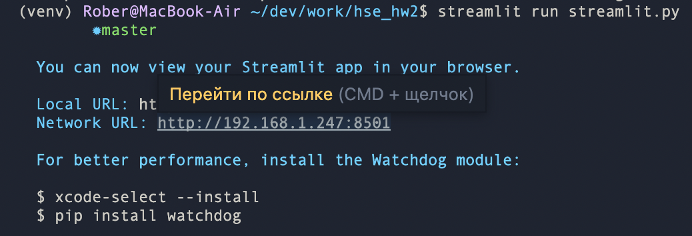

# Прочти это
## установка
1. Тебе понадобится vs code и раширение [jupyter](https://marketplace.visualstudio.com/items?itemName=ms-toolsai.jupyter) для него.
2. Открываешь vs code и командой [cmd+`] /[ctrl+`] открываешь внутренний терминал.
3. пишешь в него:
`
git clone https://github.com/Artemidividiy/hse_hw2.git
`
2. У тебя появится директория с проектом. Переходишь в нее. В ней ты увидешь все файлы проекта.
3. в терминале пишешь
`
chmod +x ./init.sh
`
`
./init.sh
`
У тебя установятся все нужные расширения библиотеки в виртуальную среду venv и она же будет запущена(Перед именем в терминале появится `(venv)`).
")
1. Открываешь файлы блокнота (У них расширение `.ipynb`). 
2. **Выполняешь последовательно!** Там сверху нажимаешь *Выполнить все*. Ждешь окончания. Возможно тебе понадобится выбрать ядро для блокнота. Выбираешь то, где есть venv. 
3. Готово
---
## Про streamlit
Есть два пути: 
   1. Ты выкладываешь проект на streamlit cloud и даешь к нему доступ, чтоб получить балл
   2. Ты показываешь на локале
### Первый путь 
Ты создаешь у себя на github публичный репозиторий в который пушишь проект. Затем ты заходишь на сайт streamlit, создаешь аккаунт, **авторизуясь через github**. Сервис сам предложит тебе запустить приложение на их стороне. Для этого копируешь ссылку на свой репозиторий с проектом и вставляешь ее в соответствующее поле. В поле выбора запускаемого файла пишешь streamlit.py или streamlit. Ждешь пока запустится. Готово
### Второй путь
Для этого тебе нужно будет в терминале запустить следующую команду: 

`
streamlit run streamlit.py
`

")
Если будет возмущаться и писать, что такого модуля `streamlit` нет, делаешь команду :

`
pip install -r requirements.txt
` 

А затем снова первую, и готово

---
## 🛑Важно
* Блокноты выполняешь один за другим, но я тебе это не советую делать
  * Во-первых, второй блокнот выполняется 10 часов
  * Во-вторых, я не уверен, будет ли он везде нормально работать, потому что у меня он то работает исправно( так я получил датасет для дальнейшей аналитики), то шлет куда подальше и вообще недоступно
  * Учитывай, что пятый блокнот выполняется пару часов, но по приколу можешь запустить. Только учти, что он очень требователен к железу. Просто, чтоб твой ноут не сгорел
* уже почищенный датасет есть в репозитории. Это `data_cleaned.csv`. Не ебись лишний раз с этим скрепингом и чисткой.
* У конвертера в стримлите ограничение на запросы - 250 в месяц. Учти это и сильно с ним не заигрывайся
  